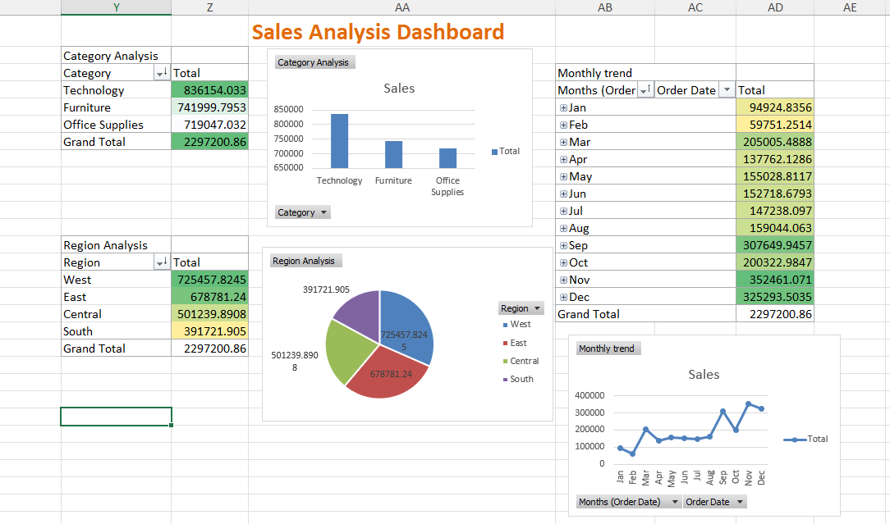

# 📊 Sales Analysis Dashboard (Excel)

## 📌 Project Overview

This project analyzes retail sales data using Microsoft Excel to extract meaningful business insights.

## 📊 Key Features

* Region-wise sales analysis
* Category-wise performance
* Monthly sales trends
* Interactive dashboard with charts

## 🔍 Insights

* Top Region: West
* Top Category: Technology
* Peak Month: November

## 🛠 Tools Used

* Microsoft Excel
* Pivot Tables
* Charts

## 📷 Dashboard Preview

